# CrackSense: Building Crack Detection & Orientation Classification
> **Hibah Penelitian 2026** — Sistem Deteksi dan Klasifikasi Orientasi Retakan Dinding/Beton Berbasis Deep Learning & Transfer Learning (*MobileNetV2, MobileNetV3Large, ResNet50, DenseNet121*).

---

## 📌 Ringkasan Proyek

Proyek **CrackSense** mengimplementasikan pipeline computer vision end-to-end untuk mendeteksi retakan pada struktur bangunan/beton dan mengklasifikasikan orientasinya ke dalam tiga kategori:
- **Diagonal** (Retakan miring/diagonal)
- **Horizontal** (Retakan mendatar)
- **Vertikal** (Retakan tegak lurus)

Informasi orientasi retakan sangat esensial dalam analisis integritas struktural teknik sipil (misalnya membedakan deformasi beban geser, penyusutan termal, atau penurunan pondasi) serta mendukung inspeksi otomatis menggunakan drone maupun perangkat inspeksi berbasis mobile/edge.

---

## 🏗️ Pipeline & Metodologi

Pipeline pelatihan dan evaluasi model dirancang dalam 3 tahapan utama:

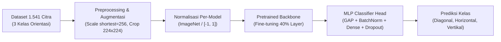

### 1. Persiapan & Karakteristik Dataset
- **Total Sampel:** 1.541 gambar retakan beton beranotasi.
- **Distribusi Kelas:**
  | Kelas | Jumlah Gambar | Proporsi |
  | :--- | :---: | :---: |
  | **Diagonal** | 540 | 35.0% |
  | **Horizontal** | 501 | 32.5% |
  | **Vertikal** | 500 | 32.4% |
  | **Total** | **1.541** | **100%** |

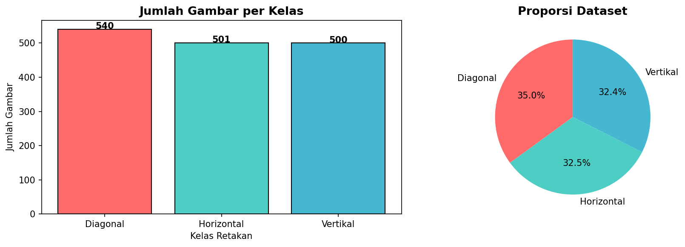

### 2. Pembagian Data (*Data Split*)
Split dilakukan menggunakan metode **Stratified Sampling** (`random_state=42`) untuk menjaga keseimbangan proporsi kelas di setiap subset:
| Subset | Proporsi | Jumlah Citra | Keterangan |
| :--- | :---: | :---: | :--- |
| **Training** | 70% | 1.079 | Diterapkan augmentasi data |
| **Validation** | 15% | 231 | Tanpa augmentasi (Center Crop) |
| **Test** | 15% | 232 | Subset independen evaluasi final |

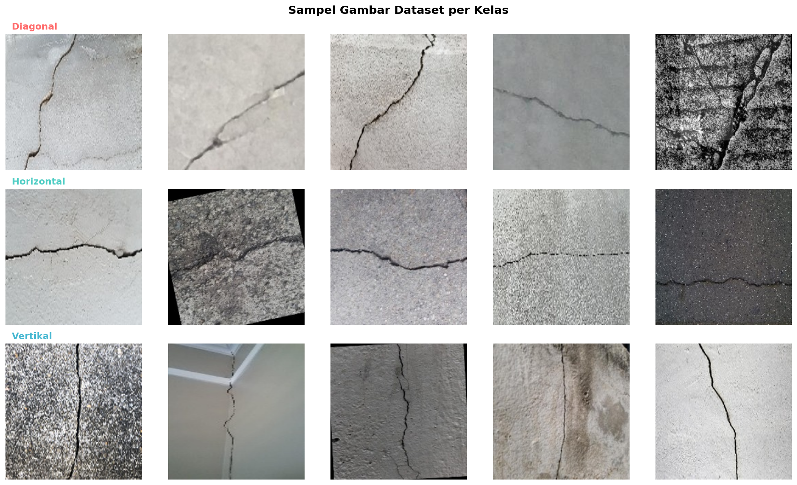

### 3. Preprocessing & Augmentasi
- **Standarisasi Ukuran:** Citra di-*resize* proporsional (sisi terpendek = 256 piksel), kemudian di-*crop* ke dimensi input standar **224 × 224 piksel**.
- **Data Augmentation (Training Only):**
  - **Random Crop** (224 × 224)
  - **Random Brightness** (± 0.2)
  - **Random Contrast** (rentang [0.8 – 1.2])
  - *Catatan penting:* Operasi *Flip* (horizontal/vertical) **sengaja tidak digunakan** karena dapat mengubah orientasi asli retakan (misal diagonal berbalik arah).
- **Normalisasi Input Berdasarkan Arsitektur Backbone:**
  | Model | Fungsi Preprocessing | Rentang Input | Karakteristik |
  | :--- | :--- | :---: | :--- |
  | **MobileNetV2** | `mobilenet_v2.preprocess_input` | `[-1, 1]` | *Linear scaling* dari `[0, 255]` |
  | **MobileNetV3Large** | `mobilenet_v3.preprocess_input` | `[-1, 1]` | *Linear scaling* dari `[0, 255]` |
  | **ResNet50** | `resnet.preprocess_input` | Mean-subtracted | BGR format, pengurangan rata-rata ImageNet |
  | **DenseNet121** | `densenet.preprocess_input` | Per-channel norm | RGB format, normalisasi per-kanal ImageNet |

---

## ⚙️ Arsitektur Model & Konfigurasi Pelatihan

Setiap arsitektur menggunakan bobot awal (*pretrained weights*) dari **ImageNet**. Pelatihan dilakukan dengan strategi *fine-tuning* proporsional.

### 1. Fine-tuning Proporsional (40% Layer)
Sebanyak **40% layer teratas/terakhir** dari backbone dibuka kuncinya (*unfreeze*), sedangkan 60% layer awal dibekukan (*frozen*):
| Model Backbone | Total Layer | Layer Frozen | Layer Unfreeze | % Unfreeze |
| :--- | :---: | :---: | :---: | :---: |
| **MobileNetV2** | 154 | 92 | 62 | 40% |
| **MobileNetV3Large** | 187 | 112 | 75 | 40% |
| **ResNet50** | 175 | 105 | 70 | 40% |
| **DenseNet121** | 427 | 256 | 171 | 40% |

### 2. Arsitektur MLP Classifier Head
Fitur spasial yang diekstraksi oleh backbone disalurkan ke struktur classifier head kustom berikut:
| No | Layer | Output Shape | Keterangan |
| :-: | :--- | :--- | :--- |
| 1 | `GlobalAveragePooling2D` | `(None, C)` | Reduksi spasial dari feature map backbone ($C$ channel) |
| 2 | `BatchNormalization` | `(None, C)` | Stabilisasi distribusi aktivasi |
| 3 | `Dense(256, activation='GELU')` | `(None, 256)` | Proyeksi ke ruang representasi 256 dimensi |
| 4 | `Dropout(0.4)` | `(None, 256)` | Regularisasi (mencegah overfitting) |
| 5 | `Dense(128, activation='GELU')` | `(None, 128)` | Kompresi representasi fitur ke 128 dimensi |
| 6 | `Dropout(0.3)` | `(None, 128)` | Regularisasi lanjutan |
| 7 | `Dense(3, activation='Softmax')` | `(None, 3)` | Distribusi probabilitas 3 kelas orientasi |

*(Dimensi channel output $C$: MobileNetV2 = 1280, MobileNetV3Large = 960, ResNet50 = 2048, DenseNet121 = 1024)*

### 3. Hyperparameter Pelatihan
- **Batch Size:** 16
- **Maksimal Epoch:** 50 (dengan Early Stopping)
- **Fungsi Loss:** Categorical Cross-Entropy
- **Optimizer:** Adam
  - *Learning Rate MobileNetV2 & V3:* `1e-5` (lebih kecil untuk menjaga stabilitas BatchNorm)
  - *Learning Rate ResNet50 & DenseNet121:* `1e-4`
- **Callbacks:**
  - `EarlyStopping(monitor='val_accuracy', patience=7, restore_best_weights=True)`
  - `ReduceLROnPlateau(monitor='val_loss', factor=0.5, patience=3, min_lr=1e-8)`

---

## 📊 Hasil Evaluasi Model

Evaluasi performa akhir dilakukan secara ketat pada **Test Set independen (232 citra)** yang belum pernah dilihat model pada tahap pelatihan maupun validasi:

### 1. Tabel Perbandingan Komparatif Semua Model
| Model Arsitektur | Val Acc (%) | Test Acc (%) | Test Precision | Test Recall | Test F1-Score | Test Loss | Trainable Params | Beban Komputasi |
| :--- | :---: | :---: | :---: | :---: | :---: | :---: | :---: | :---: |
| 🏆 **ResNet50** | **94.37%** | **95.69%** | **95.72%** | **95.76%** | **95.72%** | 0.2390 | ~19.7 M | Cukup Berat |
| 🥈 **DenseNet121** | 92.64% | 93.97% | 93.97% | 94.06% | 94.00% | **0.1980** | ~4.1 M | Cukup Berat |
| 🥉 **MobileNetV3Large**| 93.51% | 93.10% | 93.19% | 93.21% | 93.13% | 0.2423 | ~3.0 M | **Ringan (Mobile/Drone)** |
| ⚡ **MobileNetV2** | 91.77% | 92.24% | 92.44% | 92.40% | 92.24% | 0.2583 | **~2.3 M** | **Sangat Ringan** |

### 2. Analisis Performa Per Model
- **ResNet50 (Model Terbaik):** Meraih akurasi uji tertinggi (**95.69%**) dan F1-Score (**95.72%**). Memiliki konvergensi paling cepat, mencapai validasi akurasi 94.37% di epoch ke-6.
- **DenseNet121:** Mencapai *test loss* paling rendah (**0.1980**) dengan akurasi **93.97%**, menunjukkan margin separasi fitur yang sangat baik.
- **MobileNetV3Large & MobileNetV2:** Memberikan kompromi performa vs efisiensi yang optimal (> 92% akurasi dengan parameter < 3 juta), sangat ideal untuk inferensi waktu-nyata (*real-time*) di perangkat *edge* seperti drone atau smartphone.

### 3. Matriks Klasifikasi Per Kelas (Test Set - 232 Sampel)

#### ResNet50 (Akurasi: 95.69%)
| Kelas | Precision | Recall | F1-Score | Support |
| :--- | :---: | :---: | :---: | :---: |
| **Diagonal** | 0.95 | 0.93 | 0.94 | 81 |
| **Horizontal** | 0.95 | 0.99 | 0.97 | 76 |
| **Vertikal** | 0.97 | 0.96 | 0.97 | 75 |
| **Macro Avg** | **0.96** | **0.96** | **0.96** | **232** |

#### DenseNet121 (Akurasi: 93.97%)
| Kelas | Precision | Recall | F1-Score | Support |
| :--- | :---: | :---: | :---: | :---: |
| **Diagonal** | 0.94 | 0.90 | 0.92 | 81 |
| **Horizontal** | 0.95 | 0.96 | 0.95 | 76 |
| **Vertikal** | 0.94 | 0.96 | 0.95 | 75 |
| **Macro Avg** | **0.94** | **0.94** | **0.94** | **232** |

#### MobileNetV3Large (Akurasi: 93.10%)
| Kelas | Precision | Recall | F1-Score | Support |
| :--- | :---: | :---: | :---: | :---: |
| **Diagonal** | 0.94 | 0.89 | 0.91 | 81 |
| **Horizontal** | 0.96 | 0.93 | 0.95 | 76 |
| **Vertikal** | 0.90 | 0.97 | 0.94 | 75 |
| **Macro Avg** | **0.93** | **0.93** | **0.93** | **232** |

#### MobileNetV2 (Akurasi: 92.24%)
| Kelas | Precision | Recall | F1-Score | Support |
| :--- | :---: | :---: | :---: | :---: |
| **Diagonal** | 0.96 | 0.86 | 0.91 | 81 |
| **Horizontal** | 0.93 | 0.92 | 0.93 | 76 |
| **Vertikal** | 0.88 | 0.99 | 0.93 | 75 |
| **Macro Avg** | **0.92** | **0.92** | **0.92** | **232** |

---

## 📈 Visualisasi Riwayat Pelatihan & Confusion Matrix

| Model | Riwayat Pelatihan (Loss & Acc) | Confusion Matrix |
| :--- | :---: | :---: |
| **ResNet50** | 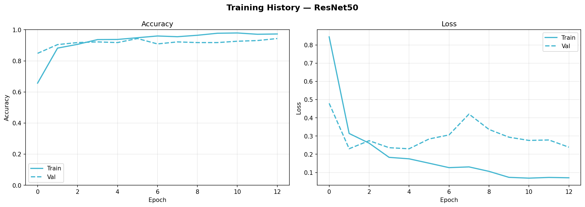 | 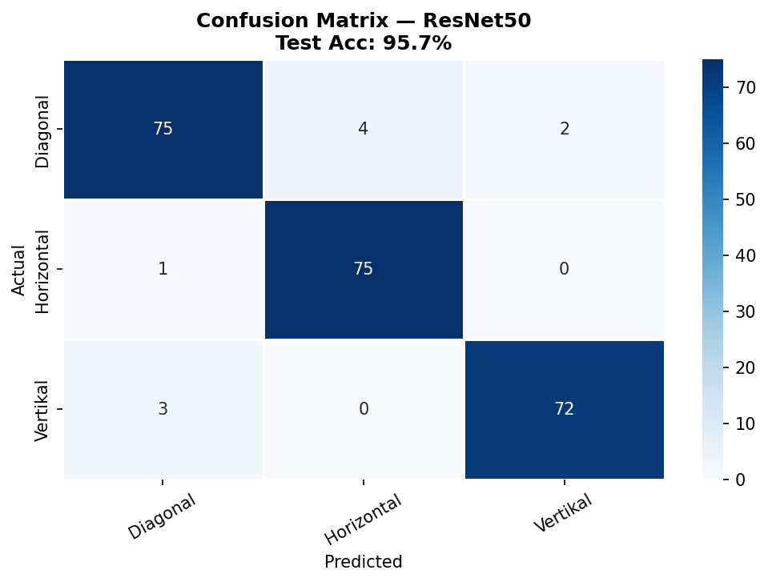 |
| **DenseNet121** | 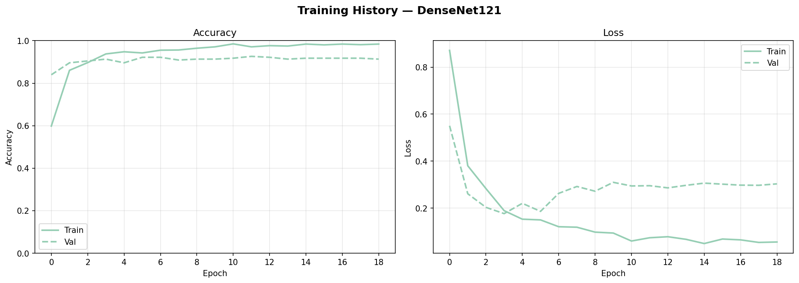 | 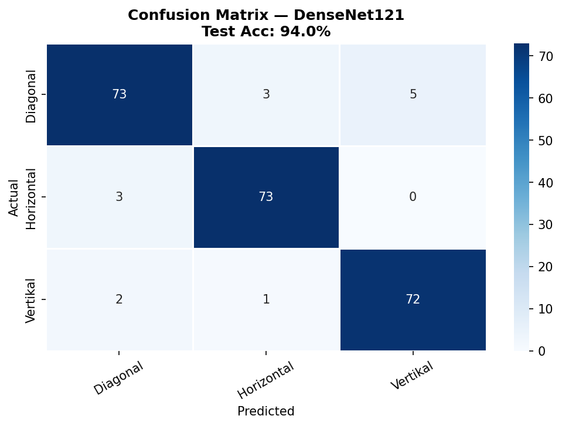 |
| **MobileNetV3Large** | 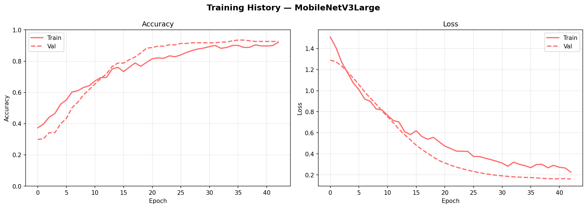 | 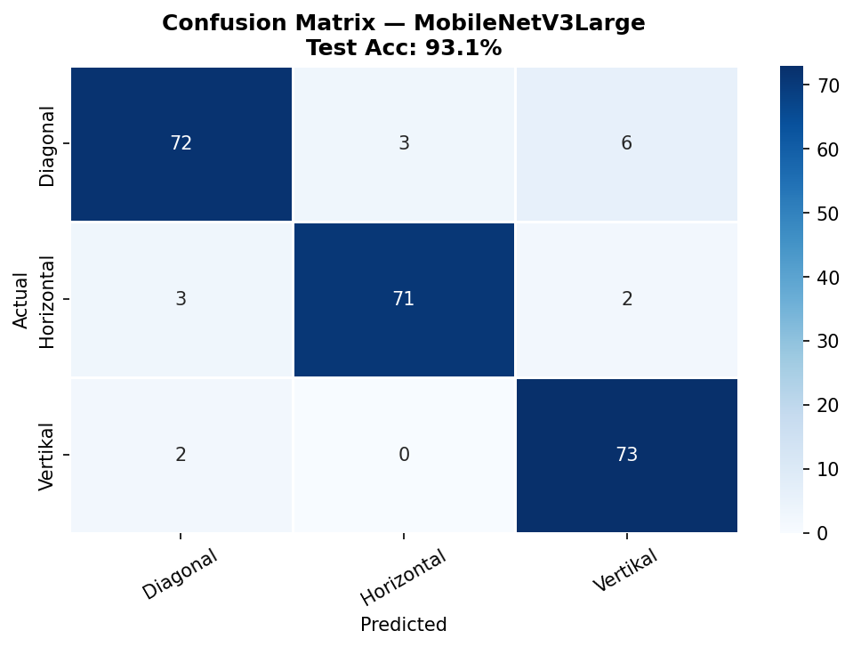 |
| **MobileNetV2** | 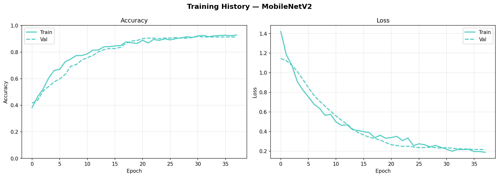 | 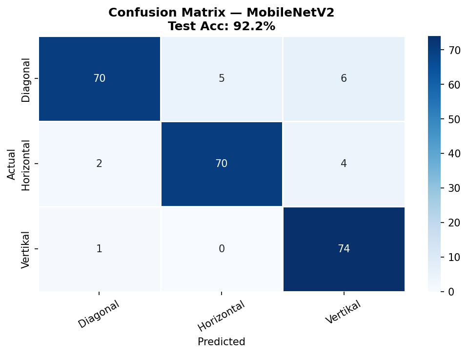 |

---

## 📱 Panduan Inferensi Mobile & Edge (TensorFlow Lite)

Untuk deployment pada aplikasi mobile (misalnya Flutter/Android) atau pemrosesan kamera drone:

### 1. Preprocessing Sebelum Masuk Model
1. **Rasio Kamera:** Disarankan rasio kamera 1:1 (*square*) agar input gambar stabil.
2. **Ukuran Gambar:** Lakukan *simple resize* langsung ke **224 × 224 piksel** (tidak memerlukan *center crop* pada tahap inferensi praktis).
3. **Normalisasi:**
   - **MobileNet:** Normalisasi nilai piksel $[0, 255]$ ke rentang $[-1.0, 1.0]$.
   - **ResNet50 / DenseNet121:** Gunakan normalisasi per-channel ImageNet sesuai fungsi preprocess masing-masing.

### 2. Membaca Output Model TFLite
Model mengeluarkan array probabilitas berukuran $1 \times 3$:
$$\text{Output} = [P_{\text{Diagonal}}, P_{\text{Horizontal}}, P_{\text{Vertikal}}]$$
- **Indeks 0:** Probabilitas retakan **Diagonal**
- **Indeks 1:** Probabilitas retakan **Horizontal**
- **Indeks 2:** Probabilitas retakan **Vertikal**
- **Keputusan Prediksi:** Mengambil indeks dengan nilai probabilitas terbesar (*argmax*). Nilai terbesar tersebut merepresentasikan tingkat keyakinan (*confidence level*) model.

---

## 📁 Struktur Repositori

```text
├── dataset/                               # Dataset citra retakan beton (1.541 gambar)
│   ├── Diagonal/                          # Folder citra kelas retakan diagonal
│   ├── Horizontal/                        # Folder citra kelas retakan horizontal
│   ├── Vertikal/                          # Folder citra kelas retakan vertikal
│   └── test/                              # Contoh sampel gambar uji
├── stash/                                 # Notebook eksperimen PyTorch
├── crack_detection_DenseNet121_fixed.ipynb       # Notebook training DenseNet121
├── crack_detection_MobileNetV2_tf_fixed.ipynb     # Notebook training MobileNetV2
├── crack_detection_MobileNetV3Large_tf_fixed.ipynb# Notebook training MobileNetV3Large
├── crack_detection_ResNet50_tf_fixed.ipynb        # Notebook training ResNet50
├── evaluate.py                            # Script evaluasi metrik model
├── train.py                               # Script pipeline training
├── run_drone_test.py                      # Script simulasi/pengujian feed drone
├── diagnose_model.py                      # Script diagnostik performa model
├── test_tflite.py                         # Script uji inferensi TFLite
├── hasil_*.csv                            # Rekapitulasi metrik evaluasi per model
├── *.png / *.jpg                          # Gambar plot distribusi, confusion matrix, & kurva
├── .gitignore                             # Aturan pengabaian file Git
└── README.md                              # Dokumentasi teknis proyek
```

---

## 🚀 Menjalankan Proyek

### 1. Setup Lingkungan
```bash
# Clone repositori
git clone https://github.com/FarellAlva/project-cracksense.git
cd project-cracksense

# Buat virtual environment (opsional namun disarankan)
python -m venv venv
source venv/bin/activate   # Linux/macOS
# atau
.\venv\Scripts\activate    # Windows
```

### 2. Instalasi Dependensi
```bash
pip install tensorflow torch torchvision opencv-python numpy pandas matplotlib seaborn scikit-learn
```

### 3. Menjalankan Evaluasi atau Testing
```bash
# Evaluasi model
python evaluate.py

# Menjalankan pengujian inferensi TFLite
python test_tflite.py
```

---

## ⚖️ Catatan File Model Weights (*Checkpoints*)
Sesuai dengan *best practices* GitHub mengenai batas ukuran file (< 100 MB), file bobot model hasil training (`.keras`, `.pth`, `.tflite`) tidak dilacak langsung di repositori utama. File model dapat diunduh melalui bagian [GitHub Releases](https://github.com/FarellAlva/project-cracksense/releases).
